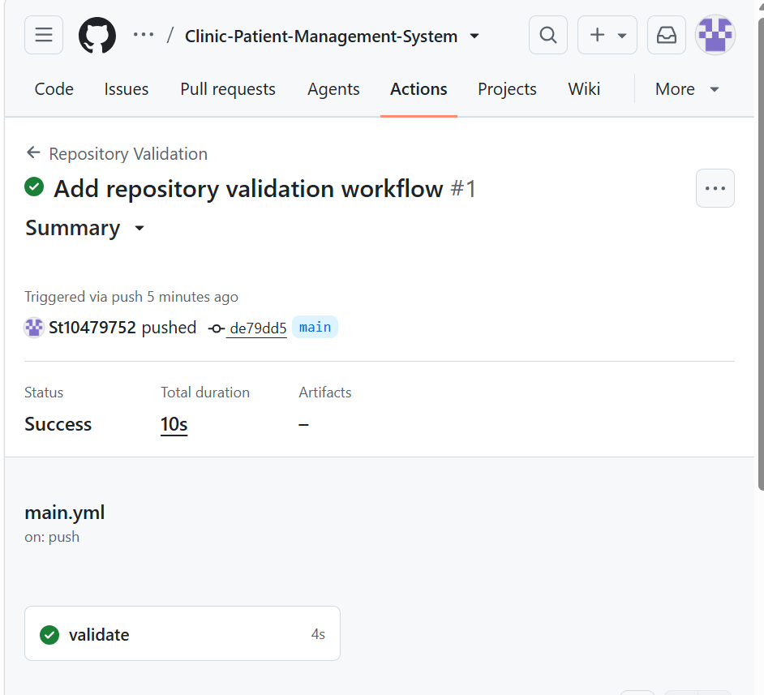

# Clinic Patient Management System

## System Description

The Clinic Patient Management System is designed to help a community health clinic manage patient information and appointments electronically. The system reduces reliance on paper-based records and helps staff register, search, update and manage patient information efficiently.

## User Roles

### 1. Receptionist

The receptionist can register patients, search and update patient records, manage appointments, and view available appointment slots.

### 2. Doctor

The doctor can view patient information, check appointments, and access relevant patient records needed for patient care.

## CI/CD Validation

The repository uses GitHub Actions to automatically validate the required project documentation. A successful workflow is indicated by a green checkmark.

## Planning Documents

The planning documents are available in the `/docs` folder:

* ERD
* Endpoint Plan
* SQL Script

## YouTube Demonstration
[Video link will be added after demonstration]

YouTube video link:

**[Paste your unlisted YouTube video link here]**

